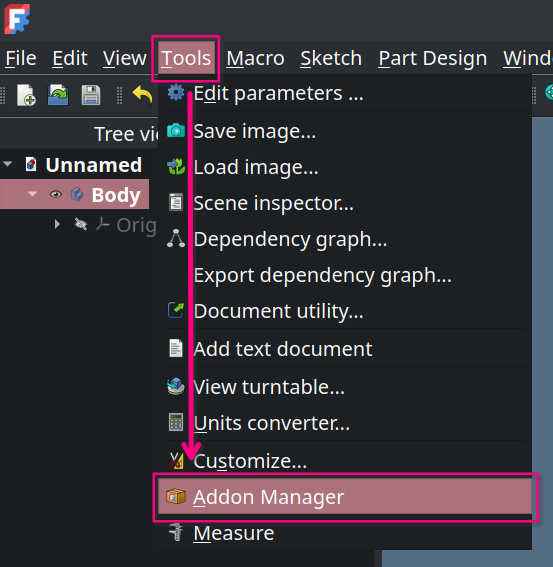
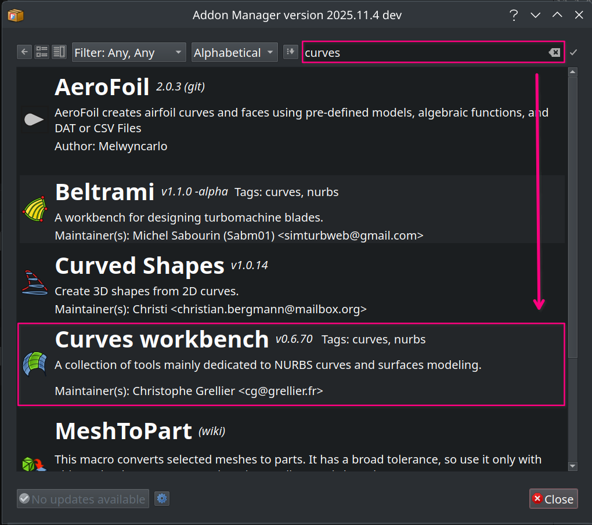
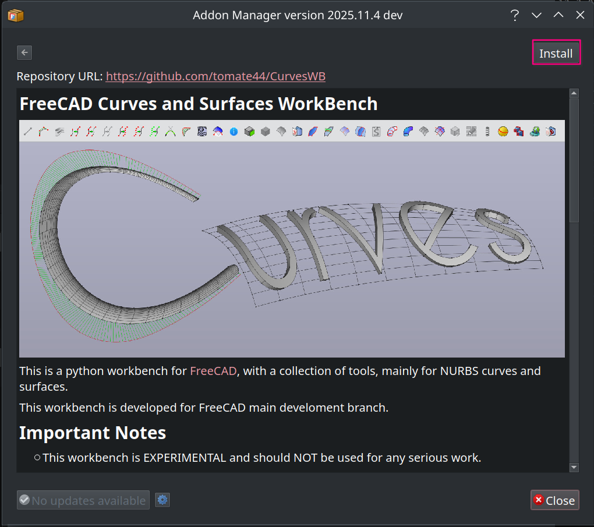
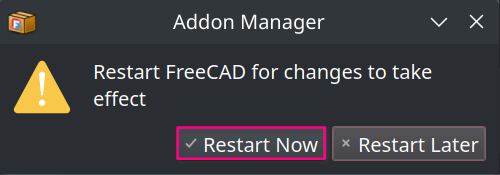

# Addon Manager

How to install an addon via the addon manager.

 

### Open The Addon Manager

Under the `Tools` dropdown menu you  
should find the `Addon Manager` options.

 

### Search For The Addon

Use the search field in the addon manager  
to find the addon you are looking for.

 

### Install The Addon

Start the installation process by clicking the `Install`  
button which will open a popup with a progress bar.

 

### Restart FreeCAD

After the installation has finished and you have closed  
the addon manager, FreeCAD will prompt you to restart.

 
